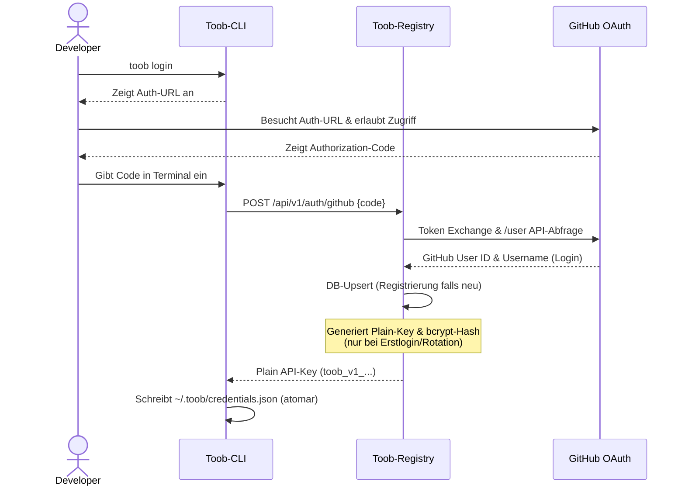
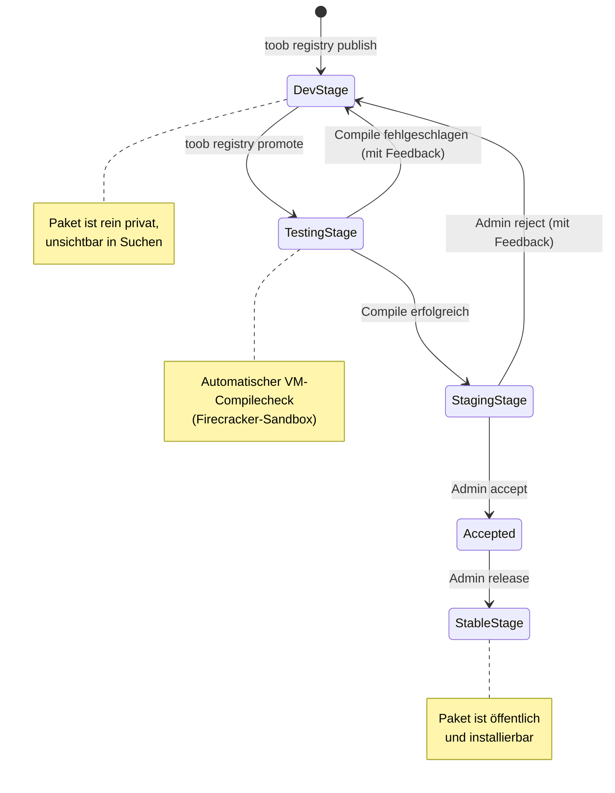

Viewed publish_test.go:1-30

I will read `toob-registry/internal/server/handler/auth.go` to understand how user registration, OAuth login, API key generation, and logouts are handled on the server side.

Viewed auth.go:1-224

I will view `cli/toob-cli/cmd/login.go` to check how the CLI manages the login process, handles credential storage, and interacts with the server auth endpoints.

Viewed login.go:1-102

I will view `cli/toob-cli/internal/registry/tar.go` to understand how the CLI packages files, handles ignores (`.toobignore` and `.gitignore`), and ensures the archive is created correctly.

Viewed tar.go:1-273

Hier ist die vollständige und detaillierte Dokumentation des **Publish- und User-Lebenszyklus** von A bis Z, direkt gestützt auf den Code.

---

# 1. User-Registrierung & Login/Logout-Zyklus (A–Z)

Der Authentifizierungszyklus regelt, wie sich Entwickler identifizieren, CLI-Clients autorisiert werden und wie Sitzungen serverseitig sicher beendet werden.



### A. Erstmaliger Login (Registrierung)
1. **CLI-Initiierung:** Der Nutzer führt `toob login` aus ([login.go:L20](file:///c:/Users/Robin/Desktop/Toob-Loader/cli/toob-cli/cmd/login.go#L20)). Die CLI zeigt eine URL zum Server-Endpoint `/api/v1/auth/github` an.
2. **OAuth im Browser:** Der Entwickler autorisiert das CLI via GitHub OAuth im Browser und erhält einen temporären `code`.
3. **Eingabe des Codes:** Der Code wird im Terminal eingegeben und an den Server gesendet ([login.go:L57](file:///c:/Users/Robin/Desktop/Toob-Loader/cli/toob-cli/cmd/login.go#L57)).
4. **Server-seitige Registrierung:** 
   * Der Server tauscht den Code bei GitHub gegen ein Access Token ein und ruft die Profilinformationen (`id` und `login`) ab ([auth.go:L45-L55](file:///c:/Users/Robin/Desktop/Toob-Loader/toob-registry/internal/server/handler/auth.go#L45-L55)).
   * Der Server ruft `UpsertGitHubUser` in der Postgres-Datenbank auf ([auth.go:L58](file:///c:/Users/Robin/Desktop/Toob-Loader/toob-registry/internal/server/handler/auth.go#L58)). Existiert der Account mit dieser GitHub-ID noch nicht, wird er neu angelegt.
   * **API-Key Generierung:** Da bei der Registrierung noch kein API-Key-Hash existiert, generiert der Server über `GenerateAPIKey` einen neuen Schlüssel ([auth.go:L68](file:///c:/Users/Robin/Desktop/Toob-Loader/toob-registry/internal/server/handler/auth.go#L68)):
     * Der Schlüssel hat das Format: `toob_v1_<PublisherUUID>_<ZufälligerBase64Secret>` ([publisher.go:L49](file:///c:/Users/Robin/Desktop/Toob-Loader/toob-registry/internal/domain/publisher.go#L49)).
     * Der geheime Teil wird mit `bcrypt` gehasht und in der DB gespeichert ([auth.go:L73](file:///c:/Users/Robin/Desktop/Toob-Loader/toob-registry/internal/server/handler/auth.go#L73)). Der Plaintext-Key wird **einmalig** an die CLI zurückgeliefert.
5. **Speichern auf dem Client:** Die CLI speichert den API-Key sowie den GitHub-Login in `~/.toob/credentials.json` ([login.go:L63](file:///c:/Users/Robin/Desktop/Toob-Loader/cli/toob-cli/cmd/login.go#L63)). Um Dateikorruption bei mehreren parallelen CLI-Prozessen zu verhindern, geschieht das Schreiben atomar über eine temporäre Datei, die danach umbenannt wird (`SaveCredentials` in `apiclient/client.go`).

### B. Erneuter Login & API-Key Rotation
* Wenn sich ein registrierter Nutzer auf einem neuen PC einloggen möchte (oder seinen Key verloren hat), liefert ein normales `toob login` **keinen** API-Key zurück, da dieser serverseitig nur als bcrypt-Hash vorliegt ([auth.go:L85](file:///c:/Users/Robin/Desktop/Toob-Loader/toob-registry/internal/server/handler/auth.go#L85)).
* Der Nutzer muss stattdessen `toob login --rotate` ausführen ([login.go:L48](file:///c:/Users/Robin/Desktop/Toob-Loader/cli/toob-cli/cmd/login.go#L48)). Der Server ruft dann `/api/v1/auth/rotate-key` auf, invalidiert den alten API-Key-Hash, generiert einen komplett frischen Key und sendet ihn im Klartext an das CLI zurück, welches die lokale Datei überschreibt ([auth.go:L131-L141](file:///c:/Users/Robin/Desktop/Toob-Loader/toob-registry/internal/server/handler/auth.go#L131-L141)).

### C. Abmelden (Logout)
1. Der Nutzer führt `toob logout` aus ([logout.go](file:///c:/Users/Robin/Desktop/Toob-Loader/cli/toob-cli/cmd/logout.go)).
2. Das CLI schickt einen authentifizierten Request an `POST /api/v1/auth/logout` ([auth.go:L153](file:///c:/Users/Robin/Desktop/Toob-Loader/toob-registry/internal/server/handler/auth.go#L153)).
3. Der Server setzt das Feld `api_key_hash` in der Datenbank für diesen User auf `NULL` (über `InvalidateAPIKey` in der DB), wodurch der API-Key sofort ungültig wird.
4. Die CLI löscht die lokale Datei `~/.toob/credentials.json`.

---

# 2. Package-Identifizierung & Manifest-Validierungsregeln

### A. Wie Kategorien erkannt werden
Die Erkennung der Package-Kategorie erfolgt **ausschließlich** durch die Anwesenheit der spezifischen Manifest-Datei im Tarball. Der Dateiname ist der Identifikator ([tarball_validate.go:L55-L63](file:///c:/Users/Robin/Desktop/Toob-Loader/toob-registry/internal/server/handler/tarball_validate.go#L55-L63)):

| Manifest-Dateiname | Erkannte Kategorie | Einsatzzweck |
| :--- | :--- | :--- |
| `chip_manifest.json` | `chip` (domain.CategoryChip) | Mikrocontroller/Hardware definitions |
| `driver_manifest.json` | `driver` (domain.CategoryDriver) | Hardware-Treiber |
| `crypto_manifest.json` | `crypto` (domain.CategoryCrypto) | Kryptografische Bibliotheken |
| `arch_manifest.json` | `arch` (domain.CategoryArch) | CPU-Architektur-Pakete |
| `toolchain_manifest.json` | `toolchain` (domain.CategoryToolchain) | Compiler- & Build-Tools |
| `integration_manifest.json` | `integration` (domain.CategoryIntegration) | Systemintegrationen & Snippets |
| `soc_manifest.json` | `soc` (domain.CategorySoC) | System-on-Chip Frameworks |

### B. Regelung bei mehreren Manifesten
* **Was passiert, wenn mehrere Manifeste erkannt werden?**
  Das System verbietet das Veröffentlichen von gemischten Paketen streng. Jedes Paket darf **exakt eine Kategorie** haben.
* **Wie reagiert der Code?**
  In `ValidateTarball` ([tarball_validate.go:L234-L240](file:///c:/Users/Robin/Desktop/Toob-Loader/toob-registry/internal/server/handler/tarball_validate.go#L234-L240)) ist folgendes implementiert:
  ```go
  if len(manifests) == 0 {
      return nil, fmt.Errorf("rejected: no manifest found")
  }
  if len(manifests) > 1 {
      names := make([]string, len(manifests))
      for i, m := range manifests {
          names[i] = m.path
      }
      return nil, fmt.Errorf("rejected: multiple manifests found: %s", strings.Join(names, ", "))
  }
  ```
  Erkennt der Ingest-Parser im Archiv (oder in einem Unterordner bis Ebene 1) mehr als ein Manifest (z. B. ein `driver_manifest.json` **und** ein `integration_manifest.json`), **bricht der Upload sofort mit einem Fehler ab**. Es wird nichts veröffentlicht und auch keine Auswahl angeboten. Es darf nur genau ein Manifest im Paket liegen.

---

# 3. Namensgebung und Scopes (Personal vs. Organisation)

Im Manifest gibt es das Feld `"name"`. Dieses bestimmt den Paket-Identifikator und muss dem Pattern `^(@[a-z0-9-]+/)?[a-z0-9-]+$` entsprechen ([tarball_validate.go:L71](file:///c:/Users/Robin/Desktop/Toob-Loader/toob-registry/internal/server/handler/tarball_validate.go#L71)).

### A. Un-scoped Packages (z. B. `"name": "uart-driver"`)
* **Namensschutz (Hijacking-Schutz):**
  Jeder verifizierte Publisher darf ein neues un-scoped Paket hochladen. Das Paket startet in der privaten Entwicklungsphase (`dev`).
  * Die Registrierung der Eigentümerschaft erfolgt erst bei der **Promotion** in die Testphase (`testing` -> `staging` -> `stable`).
  * In [publish.go:L287](file:///c:/Users/Robin/Desktop/Toob-Loader/toob-registry/internal/server/handler/publish.go#L287) wird geprüft, wer das Paket besitzt:
    ```go
    ownerID, err := h.packages.GetPackageOwner(ctx, req.Name)
    ```
    Gibt es bereits eine freigegebene Version (`staging` oder `stable`) dieses Pakets in der DB, die einem anderen Publisher gehört, wird die Promotion mit einem `403 Forbidden` abgewiesen. Damit ist ein Missbrauch oder das Kitzeln fremder Packages (Typosquatting/Hijacking) unterbunden.

### B. Scoped Packages (z. B. `"name": "@publisher-a/uart"` oder `"name": "@esp-alliance/uart"`)
Beim Upload prüft der Server den Scope ([publish.go:L128-L140](file:///c:/Users/Robin/Desktop/Toob-Loader/toob-registry/internal/server/handler/publish.go#L128-L140)):
1. **Personal Scope Check:** Entspricht der Scope dem eigenen GitHub-Login (z. B. `@publisher-a/...` für den angemeldeten Benutzer `publisher-a`), ist die Autorisierung automatisch erfolgreich.
2. **Organisation Scope Check:** Gehört der Scope einer Organisation (z. B. `@esp-alliance/...`), führt der Server eine DB-Abfrage aus:
   ```go
   isMember, err := h.organizations.IsOrgMember(r.Context(), orgName, pub.ID)
   ```
   Ist der Publisher in der Tabelle `organization_members` eingetragen, ist er autorisiert und der Upload wird verarbeitet. Andernfalls bricht das System mit der Fehlermeldung `SCOPE_FORBIDDEN` (HTTP 403) ab.

---

# 4. Der vollständige Paket-Veröffentlichungszyklus (A–Z)

Hier ist der Ablauf von der lokalen Entwicklung bis zur weltweiten Installation durch andere Nutzer:



### 1. Lokal verpacken und hochladen (`StageDev`)
* Der Entwickler führt `toob registry publish` in seinem Repository aus ([publish.go](file:///c:/Users/Robin/Desktop/Toob-Loader/cli/toob-cli/cmd/publish.go)).
* Die CLI erstellt einen gzipped Tarball, filtert ihn via `.toobignore` und lädt ihn hoch.
* Der Server validiert den Tarball in 6 Schritten (Größe, Erweiterungs-Whitelist, symlink-frei, etc.).
* Das Paket wird in der Datenbank mit der Phase `dev` gespeichert ([publish.go:L165](file:///c:/Users/Robin/Desktop/Toob-Loader/toob-registry/internal/server/handler/publish.go#L165)) und die Binärdatei in S3 hochgeladen.
* **Ergebnis:** Das Paket existiert, ist aber privat (nur für den Autor sichtbar, z. B. in `toob registry mine`).

### 2. Automatisierte Validierung (`StageTesting`)
* Der Entwickler triggert die Promotion mittels `toob registry promote <name>@<version>` ([publish.go:L249](file:///c:/Users/Robin/Desktop/Toob-Loader/toob-registry/internal/server/handler/publish.go#L249)).
* Der Server schiebt das Paket in den Status `testing` und reiht einen Validierungsjob in die Queue ein.
* Ein Registry-Worker (Container/VM) holt sich den Job, liest den `"reference_build_context"` (Ziel-Chip, SDK, Toolchain) aus dem Paketmanifest aus, startet eine isolierte Firecracker-VM und kompiliert den Treiber.
  * **Fehlschlag:** Tritt ein Compilerfehler auf, bricht der Job ab. Der Status wird auf `dev` zurückgesetzt und die Compilerfehler-Logs werden als `error_summary` in der DB gespeichert, damit der Entwickler sie beheben kann.
  * **Erfolg:** Kompiliert das Paket fehlerfrei, befördert das System es automatisch in die Staging-Review-Phase (`staging`).

### 3. Manuelles Audit (`StageStaging`)
* Ein Admin (Toob Core Team) führt `toob admin staging` aus, um ausstehende Pakete zu sichten ([admin.go:L23](file:///c:/Users/Robin/Desktop/Toob-Loader/cli/toob-cli/cmd/admin.go#L23)).
* Der Admin prüft das Paket manuell.
  * **Reject:** Missfällt der Code, führt er `toob admin reject <name>@<version> --reason "..."` aus. Das Paket wird zurückgewiesen und geht in die `dev`-Phase zurück.
  * **Accept:** Passt alles, markiert er es mit `toob admin accept <name>@<version>` als akzeptiert.

### 4. Release in den öffentlichen Index (`StageStable`)
* Schließlich führt ein Admin den finalen Batch-Release aus: `toob admin release` ([admin.go:L135](file:///c:/Users/Robin/Desktop/Toob-Loader/cli/toob-cli/cmd/admin.go#L135)).
* Alle akzeptierten Pakete werden atomar in den Status `stable` versetzt, signiert (Vault-Transit-Signierung) und in den öffentlichen Index aufgenommen.
* Jetzt ist das Paket für alle Entwickler weltweit über `toob install` installierbar und über `toob registry search` auffindbar.