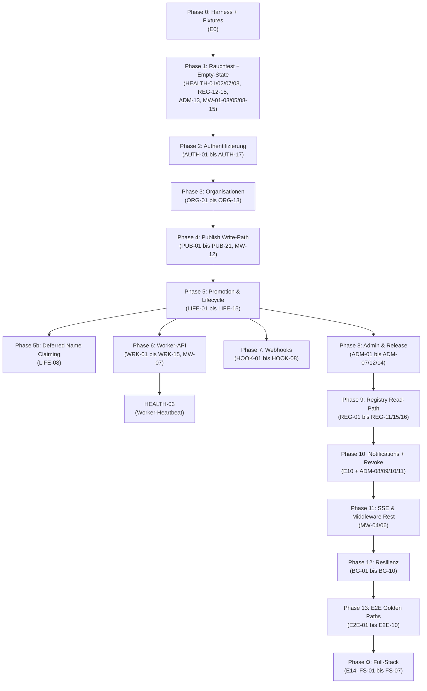

# Chronologische Test-Sequenzierung der `test_architecture.md`

> Analyse der bestehenden Test-Architektur auf Abhängigkeiten und Erstellung einer chronologisch korrekten "From Zero to Functional Registry"-Testsequenz.

---

## Kontext

Nach erfolgreichem `wizard`-Deployment liefert der `toob-ops status` alle Checks grün:

```
Vault ● Unsealed, Nomad ● Active/Ready, Edge ● 200 OK, 
DB/S3/Vault ● ok, Allocations 3/3 Healthy
```

Ab **diesem Zeitpunkt** ist das Dev-Environment bereit für die funktionalen Tests. Die Frage ist: **In welcher Reihenfolge** müssen die 100+ Test-Stories der `test_architecture.md` ablaufen, damit keine Story auf Daten angewiesen ist, die eine spätere Story erst erzeugt?

---

## User Review Required

> [!IMPORTANT]
> Die bestehende `test_architecture.md` ordnet ihre Stories nach **thematischen Epics** (E0–E14), nicht nach einer ausführbaren Reihenfolge. Das ist als Backlog-Format sinnvoll, aber für einen sequenziellen Testlauf gegen ein leeres Environment problematisch. Dieser Plan definiert eine **Ausführungsreihenfolge** als Overlay — die Epic-IDs bleiben stabil.

> [!WARNING]
> Einige Tests (E14: Real-Worker, Autoscaler) erfordern Infrastruktur (KVM, Hetzner-API, echtes GitHub), die im Dev-Environment nicht verfügbar ist. Diese werden als "Phase Ω" am Ende markiert und aus der Pflicht-Sequenz ausgeklammert.

---

## Abhängigkeitsanalyse — Was die `test_architecture.md` implizit voraussetzt

### Problem 1: Identitäten existieren nicht

Die API hat **keinen** Endpoint zum Anlegen von Publishern ohne echten GitHub-OAuth-Flow. Das steht korrekt in `E0-04` und `E0-10–15` dokumentiert. **Aber:** Die Epics E2–E13 nutzen `alice`, `bob`, `core-admin`, `mallory` als wären sie bereits vorhanden — ohne dass die Reihenfolge explizit sagt: "Zuerst E0, dann alles andere."

**Auswirkung:** Korrekt erkannt im Dokument. Kein Fix nötig, nur Sequenzierung.

### Problem 2: Leeres Environment hat keine Packages

Folgende Tests setzen Pakete voraus, die erst durch vorherige Tests erzeugt werden:

| Test | Benötigt | Erzeugt durch |
|------|----------|---------------|
| `LIFE-01` (Promote) | dev-Package mit `reference_build_context` | `PUB-01` |
| `LIFE-06` (Worker PASS → staging) | Job in QUEUED (aus Promote) | `LIFE-01` |
| `REG-06` (Package sichtbar) | stable-Package | `ADM-02` (Release) |
| `REG-07` (Download) | stable-Package mit S3-Objekt | `ADM-02` |
| `REG-08` (Search) | stable-Package | `ADM-02` |
| `ADM-01` (Staging-Review) | Package in staging | `LIFE-06` |
| `ADM-02` (Release) | accepted Packages | `ADM-01` |
| `ADM-08` (Revoke) | stable Package | `ADM-02` |
| `NOTIF-02` (Revoke-Notification) | stable + synced Package | `ADM-02` + `NOTIF-01` |
| `E2E-01` bis `E2E-07` | Gesamter Lifecycle | Alles vorher |

### Problem 3: Org-Tests brauchen Publisher, keine Packages

Die Org-Tests (E6) sind **unabhängig** von Packages, brauchen aber mindestens 2 Publisher (`alice`, `bob`). Sie können also relativ früh laufen — **nach** E0 und E2, **vor** E3.

### Problem 4: Health-Tests sind teilweise Post-Deployment-Checks

- `HEALTH-01` und `HEALTH-02` sind reine Infrastruktur-Checks → **Phase 1**.
- `HEALTH-03` (Worker-Heartbeat) braucht einen Worker-Heartbeat → erst nach `WRK-08` sinnvoll.
- `HEALTH-04` (Shutdown-Drain) ist ein Manual-Test → **Phase Ω**.
- `HEALTH-05` und `HEALTH-06` (Metrics) sind unabhängig → **Phase 1**.

### Problem 5: Middleware-Tests sind orthogonal

`E11` (Rate-Limit, Body-Limit, Compression, Timeout, Panic-Recovery) hat keine Datenabhängigkeiten. Kann jederzeit laufen, idealerweise als **Rauchtest** früh in der Sequenz.

---

## Vorgeschlagene Ausführungsreihenfolge

### Phase 0 — Harness & Fixtures (E0)

**Voraussetzung:** Dev-Environment deployed, alle Status-Checks grün.

| Schritt | Stories | Was passiert |
|---------|---------|-------------|
| 0.1 | `E0-01` bis `E0-07` | Test-Harness aufbauen: HTTP-Client, mTLS-Client, S3-PUT-Fähigkeit, DB-Zugriff, HMAC-Signierer, Polling-Helper, Vault-Erreichbarkeit prüfen |
| 0.2 | `E0-10` bis `E0-15` | Seed-Identitäten per DB-Insert: `core-admin` (role=core), `alice` (contributor/free), `bob` (contributor/free), `mallory` (suspended), Enterprise-Publisher |
| 0.3 | `E0-20` bis `E0-23` | Fixture-Tarballs erzeugen (gültig je Kategorie, bösartige Varianten, Typosquat-Kandidat) |
| 0.4 | `E0-30` | Reset-Strategie definieren (DELETE/Truncate zwischen Epic-Runs) |

---

### Phase 1 — Infrastruktur-Rauchtest + Empty-State-Smoke (E1 teilw. + E11 teilw.)

**Ziel:** Sicherstellen, dass der API-Server grundsätzlich antwortet — **auch auf einem komplett leeren System**.

| Schritt | Stories | Was passiert |
|---------|---------|-------------|
| 1.1 | `HEALTH-01` | `GET /health` → 200 alive |
| 1.2 | `HEALTH-02` | `GET /ready` → 200, db/s3/vault ok |
| 1.3 | `HEALTH-07` | **Empty-State-Readiness:** Leere Tabellen → kein Crash (NULL-tolerant) |
| 1.4 | `HEALTH-05` | Metrics-Endpoint (mTLS) erreichbar |
| 1.5 | `HEALTH-08` | **Queue-Depth bei leeren Queues:** Metrik-Keys existieren mit Wert `0` |
| 1.6 | `HEALTH-06` | Pfad-Normalisierung in Metriken |
| 1.7 | `REG-12` | **Empty-State Index:** Leerer Index, gültige Signatur |
| 1.8 | `REG-13` | **Empty-State Suche:** `search?q=x` → leere Liste, keine dev-Leaks |
| 1.9 | `REG-14` | **Empty-State Resolve:** Alle Resolve-Endpoints antworten sauber |
| 1.10 | `REG-15` | **Download nicht-existierendes Paket** → uniform 404 |
| 1.11 | `ADM-13` | **Admin-Dashboard Empty-State:** Zähler auf 0, kein Division-by-Zero |
| 1.12 | `MW-01` | Rate-Limit funktioniert (Burst → 429) |
| 1.13 | `MW-08` | **Rate-Limit-Recovery:** Nach `Retry-After` → wieder 200 |
| 1.14 | `MW-09` | **Rate-Limit IP-Isolation:** IP-A geblockt, IP-B ungestört |
| 1.15 | `MW-02` | Body-Limit funktioniert |
| 1.16 | `MW-03` | gzip-Kompression |
| 1.17 | `MW-05` | X-Request-ID wird gesetzt |
| 1.18 | `MW-10` | **Unbekannte Route** → 404 (JSON, nicht HTML) |
| 1.19 | `MW-11` | **Falsche HTTP-Methode** → 405 |
| 1.20 | `MW-13` | **HEAD-Request-Verhalten** (Monitoring-Probes) |
| 1.21 | `MW-14` | **CORS-Verhalten** (kein unbeabsichtigtes Allow-Origin) |
| 1.22 | `MW-15` | **Doppel-Slash/Trailing-Slash** URL-Normalisierung |

> [!NOTE]
> `HEALTH-03` (Worker-Heartbeat) wird **aufgeschoben** bis Phase 6 (Worker-API). `HEALTH-04` (Shutdown) ist Phase Ω. Die Empty-State-Tests (`REG-12`–`REG-14`, `ADM-13`) laufen hier bewusst **vor** jeglichem Publish, um zu beweisen, dass der Server auf einem leeren System nicht crasht.

---

### Phase 2 — Authentifizierung & Identität (E2)

**Ziel:** Alle Auth-Pfade testen, bevor irgendwelche geschützten Endpoints genutzt werden.

| Schritt | Stories | Was passiert |
|---------|---------|-------------|
| 2.1 | `AUTH-05` | Bearer-Format-Validierung (Negativtest: kein Token, Müll-Token) |
| 2.2 | `AUTH-15` | **Malformed JSON** am Auth-Endpoint → 400 (kein Panic/Stack-Trace) |
| 2.3 | `AUTH-17` | **Falsche HTTP-Methode** auf Auth-Endpoints → 405 |
| 2.4 | `AUTH-06` | Session-Token gültig: `GET /me` mit Seed-Key → 200 |
| 2.5 | `AUTH-09` | Suspendierter Publisher `mallory` → 401 |
| 2.6 | `AUTH-14` | Contributor vs. Admin-Endpoint → 403 |
| 2.7 | `AUTH-07` | CI-Token-Lebenszyklus: Create/List/Delete |
| 2.8 | `AUTH-16` | **Abgelaufener CI-Token** (`expires_at` in Vergangenheit) → 401 |
| 2.9 | `AUTH-08` | Scope-Prefix-Semantik (publish deckt publish:promote ab) |
| 2.10 | `AUTH-13` | Admin verlangt Session-Token (CI-Token → 403) |
| 2.11 | `AUTH-12` | Logout invalidiert Key → Re-Seed nötig |
| 2.12 | `AUTH-10` | Token-Cache-Smoke (optional, Performance) |
| 2.13 | `AUTH-11` | `last_used_at`-Drossel |
| 2.14 | `AUTH-01` bis `AUTH-04` | OAuth-Flow-Tests (Redirect, PKCE, Einmaligkeit) — **nur testbar wenn DB-Seed einer oauth_session möglich** |

> [!IMPORTANT]
> Nach `AUTH-12` (Logout) muss der API-Key für `alice` neu geseedet werden, bevor Phase 3 starten kann!

---

### Phase 3 — Organisationen (E6)

**Warum hier?** Org-Tests brauchen nur Publisher (aus Phase 0/2), keine Packages. Sie erzeugen aber den Org-Scope-Kontext, den Publish-Tests (E3) für Scoped-Packages brauchen.

| Schritt | Stories | Was passiert |
|---------|---------|-------------|
| 3.1 | `ORG-11` | **`orgs/mine` ohne Mitgliedschaften** → 200, leere Liste |
| 3.2 | `ORG-01` | Org anlegen, Quota, Validierung |
| 3.3 | `ORG-13` | **Reservierte Org-Namen** (`admin`, `api`, `system`, `www`) → 400 |
| 3.4 | `ORG-02` | Org-Lookup, eigene Orgs |
| 3.5 | `ORG-03` | Mitglied hinzufügen (Rollen-Autorität) |
| 3.6 | `ORG-12` | **Doppeltes Mitglied-Hinzufügen** → Idempotenz-Verhalten klären |
| 3.7 | `ORG-04` | Mitglied entfernen (Hierarchie) |
| 3.8 | `ORG-05` | Mitglieder listen |
| 3.9 | `ORG-10` | Plan-Upgrade → mehr Orgs |
| 3.10 | `ORG-06` | Scoped Publish vorbereiten (Login-Scope) — **nur Authz-Check, kein Package-Upload** |
| 3.11 | `ORG-07` | Scoped Publish via Mitgliedschaft (mit Upload in Phase 4 verifiziert) |
| 3.12 | `ORG-09` | Org löschen (Owner + Admin-Bypass) |

> [!NOTE]
> `ORG-06` und `ORG-07` testen primär die **Autorisierung** (Scope-Claim). Das eigentliche Package-Upload geschieht in Phase 4. Für den reinen Scope-Check muss aber noch eine Org existieren → `ORG-09` (Delete) erst nach `ORG-06`/`ORG-07` ausführen, oder eine separate Test-Org verwenden.

---

### Phase 4 — Publish Write-Path (E3)

**Ziel:** Pakete ins System bringen (Stage `dev`).

| Schritt | Stories | Was passiert |
|---------|---------|-------------|
| 4.1 | `PUB-17` | Unauth → 401 |
| 4.2 | `PUB-18` | **Content-Type-Mismatch** (JSON statt multipart) → 400 |
| 4.3 | `PUB-21` | **Leeres Tarball** (0 Bytes) → 400, kein Panic |
| 4.4 | `MW-12` | **Malformed JSON** auf `POST /publish/promote` und ähnlichen → 400 |
| 4.5 | `PUB-01` | **Happy Path:** alice published gültiges Chip-Tarball → 201, stage=dev |
| 4.6 | `PUB-02` | Permission-Check |
| 4.7 | `PUB-03` | Duplikat-SHA → 409 |
| 4.8 | `PUB-04` | Versions-Konflikt (gleicher Name, anderer SHA) → 409 |
| 4.9 | `PUB-19` | **Package-Name-Randfälle** (Großbuchstaben, Unicode, SQL-Injection, nur-Bindestriche, max Länge) → 400 |
| 4.10 | `PUB-20` | **Version-Randfälle** (0.0.0, v-Prefix, Pre-Release, unvollständig, leer) |
| 4.11 | `PUB-05` | Dev-Quota (10 Slots füllen, 11. → 429) |
| 4.12 | `PUB-06` | Plan vs. Host-Cap min-Logik |
| 4.13 | `PUB-07` | Heuristik-Warnings (nicht blockierend) |
| 4.14 | `PUB-08` bis `PUB-14` | Alle 6-Gate-Negativ-Tests (Path-Traversal, Symlinks, Binaries, Limits, Manifest-Fehler, Binär-Heuristik) |
| 4.15 | `PUB-15`, `PUB-16` | Multipart-/Body-Limits |
| 4.16 | `ORG-06`/`ORG-07` (Publish-Teil) | Scoped Publish: `@alice/pkg`, `@acme/widget` → 201 |

> **Ergebnis dieser Phase:** Mehrere Pakete in `dev`, darunter mindestens eines mit `reference_build_context`.

---

### Phase 5 — Promotion & Package-Lifecycle (E4)

**Ziel:** Pakete von `dev` → `testing` → `staging` bewegen (Simulated Worker).

| Schritt | Stories | Was passiert |
|---------|---------|-------------|
| 5.1 | `LIFE-15` | **`packages/mine` auf leerem Account** → 200, leere Liste |
| 5.2 | `LIFE-01` | Promote dev → testing (mit reference_build_context) |
| 5.3 | `LIFE-02` | Promote ohne reference_build_context → 400 |
| 5.4 | `LIFE-03` | Promote aus Nicht-dev → 409 |
| 5.5 | `LIFE-04` | Promote-Idempotenz |
| 5.6 | `LIFE-05` | Testing+Staging-Quota |
| 5.7 | `LIFE-10` | SSE Job-Stream (parallel zum Worker) |
| 5.8 | `LIFE-06` | **Simulated Worker PASS** → staging |
| 5.9 | `LIFE-07` | **Simulated Worker FAIL** → dev mit Feedback |
| 5.10 | `LIFE-09` | Ownership-Guard (bob darf alice's Name nicht promoten) |
| 5.11 | `LIFE-11` | Job-Status-Abfrage & Authz |
| 5.12 | `LIFE-12` | Unpublish (nur dev) |
| 5.13 | `LIFE-13` | Stage-Transition-Trigger (DB-Invariante) |
| 5.14 | `LIFE-14` | **Promote nach Logout/Re-Auth** → Key-Rotation unterbricht Paket-Zustand nicht |

> **Ergebnis:** Mindestens 1 Paket in `staging` (pending), Ready für Admin-Review.

---

### Phase 5b — Deferred Name Claiming (LIFE-08)

Sonderschritt, weil er **zwei Publisher gleichzeitig** benötigt und einen Race simuliert:

| Schritt | Stories | Was passiert |
|---------|---------|-------------|
| 5b.1 | `LIFE-08` | alice + bob → gleicher name@version → beide dev, beide promote, beide Worker PASS → erster staging, zweiter 409 + auto-revert |

---

### Phase 6 — Worker-API & Zero-Trust (E8)

**Ziel:** Vollständige Worker-API-Tests (mTLS, Validation-Claim, Upload, Complete).

| Schritt | Stories | Was passiert |
|---------|---------|-------------|
| 6.1 | `WRK-01` | mTLS-Identitätszwang (kein Cert → 401, falscher CN → 403) |
| 6.2 | `WRK-14` | **Claim ohne wartende Jobs** (alle drei Typen) → 204, kein Fehler |
| 6.3 | `WRK-02` | Validation-Claim (leer → 204, mit Job → 200) |
| 6.4 | `WRK-03` | Upload-Request (presigned URLs) |
| 6.5 | `WRK-04` | **Complete PASS → Ingestion → staging** (vollständiger Pfad) |
| 6.6 | `WRK-15` | **Complete mit manipuliertem Paket-Pfad** → Server lehnt Ingestion ab |
| 6.7 | `WRK-05` | Complete FAIL |
| 6.8 | `WRK-06` | Job-Token-Lebenszyklus |
| 6.9 | `WRK-07` | Publish-Claim & Download |
| 6.10 | `WRK-08` | **Heartbeat** → aktualisiert system_status |
| 6.11 | `HEALTH-03` | ← **Jetzt testbar:** Worker-Heartbeat → `worker="ok"` in `/ready` |
| 6.12 | `WRK-09` | Release-Claim (Capability-Filter) |
| 6.13 | `WRK-10` | Release-Complete Idempotenz + Token-Grace |
| 6.14 | `WRK-11` | Release-Upload-Request & Log-Chunk |
| 6.15 | `WRK-12` | Compiler-Job-Deferral (ggf. E14) |
| 6.16 | `WRK-13` | Body-Limits intern |
| 6.17 | `MW-07` | **Interner Rate-Limit** (Worker-API eigener Limiter) |

---

### Phase 7 — Webhooks (E9)

**Ziel:** PR/Push/Release-Webhook-Handling testen.

| Schritt | Stories | Was passiert |
|---------|---------|-------------|
| 7.1 | `HOOK-01` | HMAC-Zwang |
| 7.2 | `HOOK-02` | Event-Typ-Filter |
| 7.3 | `HOOK-03` | **Mock-Webhook** → Validation-Job erzeugt |
| 7.4 | `HOOK-04` | Opt-In (nicht-registrierter User → 403) |
| 7.5 | `HOOK-05` | Path-Guard |
| 7.6 | `HOOK-06` | PR closed → Cancel |
| 7.7 | `HOOK-07` | Push auf main → SemVer-Job |
| 7.8 | `HOOK-08` | Release published → Ecosystem-Promotion |

---

### Phase 8 — Admin & Release-Lifecycle (E7)

**Voraussetzung:** Pakete in `staging` (aus Phase 5).

| Schritt | Stories | Was passiert |
|---------|---------|-------------|
| 8.1 | `ADM-14` | **Release ohne vorigen Accept** → 400 (dedizierter Leerfall) |
| 8.2 | `ADM-03` | Dashboard-Status (Prüfen, dass Staging-Pakete sichtbar) |
| 8.3 | `ADM-01` | **Staging-Review:** accept (+ reject-Pfad) |
| 8.4 | `ADM-02` | **Release-Batch:** staging → stable, neue Revision |
| 8.5 | `ADM-12` | **Audit-Log-Integrität:** DB-Verifikation nach Release (action, actor, target, timestamp) |
| 8.6 | `ADM-04` | Format-Version-Bump |
| 8.7 | `ADM-05` | Matrix-Update |
| 8.8 | `ADM-06` | Cache-Purge |
| 8.9 | `ADM-07` | Set-Plan |
| 8.10 | `ORG-08` | Scoped Job-Visibility (jetzt mit echtem Job testbar) |

> **Ergebnis:** Mindestens 1 Paket in `stable`, Registry-Revision ≥ 1. Audit-Log nachweislich korrekt befüllt.

---

### Phase 9 — Registry Read-Path & Caching (E5)

**Voraussetzung:** Stable-Pakete existieren (aus Phase 8).

| Schritt | Stories | Was passiert |
|---------|---------|-------------|
| 9.1 | `REG-01` | Revision (jetzt ≥ 1, mit Signatur) |
| 9.2 | `REG-02` | Index + ETag/304 |
| 9.3 | `REG-03` | Index-Signatur-Caching |
| 9.4 | `REG-04` | Sync seit Revision |
| 9.5 | `REG-05` | Resolve-Endpoints (Chip/Matrix/Integrations/Registry/Combination) |
| 9.6 | `REG-06` | Package-GET Sichtbarkeit (stable öffentlich, dev/staging → 404 für Fremde) |
| 9.7 | `REG-15` | **Download nicht-existierendes Paket** (existierender Name, falsche Version) → 404 |
| 9.8 | `REG-07` | Download-Redirect + Counter |
| 9.9 | `REG-08` | Suche (Full-Text, nur stable) |
| 9.10 | `REG-16` | **Search-Query-Injection** (SQL-Injection, Sonderzeichen, 1000-Zeichen-Query) → 200 leer |
| 9.11 | `REG-09` | Ecosystem-Release-Download (Yank/Deprecation-Pfade) |
| 9.12 | `REG-10` | Cache-Sync nach Release |
| 9.13 | `REG-11` | Optional-Auth am Package-Pfad |

---

### Phase 10 — Notifications & Advisories (E10) + Revoke (E7 Rest)

**Voraussetzung:** Stable-Paket existiert, mindestens 1 Publisher hat gesyncted.

| Schritt | Stories | Was passiert |
|---------|---------|-------------|
| 10.1 | `NOTIF-01` | Sync-Ack protokolliert (bob synct Revision) |
| 10.2 | `ADM-08` | **Revoke** + Advisory-Kette |
| 10.3 | `NOTIF-02` | Revoke erzeugt Notification für bob |
| 10.4 | `NOTIF-03` | In-Band-Delivery via Ack |
| 10.5 | `NOTIF-04` | Acknowledge |
| 10.6 | `NOTIF-05` | Auth-Zwang |
| 10.7 | `ADM-09` | Archive (auf verbleibendes stable-Paket) |
| 10.8 | `ADM-10` | Mirror-Push (nur "accepted, no error") |
| 10.9 | `ADM-11` | Release-Lifecycle (Ecosystem: Trigger/Cancel/Yank/Unyank/Deprecate) |

---

### Phase 11 — SSE & Middleware-Tiefentests (E11 Rest)

> [!NOTE]
> Die meisten Middleware-Tests (MW-01 bis MW-03, MW-05, MW-07 bis MW-15) laufen bereits in Phase 1 bzw. Phase 6. Hier nur die übrigen, die spezifische Vorbedingungen brauchen.

| Schritt | Stories | Was passiert |
|---------|---------|-------------|
| 11.1 | `MW-04` | Timeout vs. SSE (SSE nicht nach 30s gekappt — braucht einen aktiven Job-Stream aus Phase 5) |
| 11.2 | `MW-06` | Panic-Recovery |

---

### Phase 12 — Resilienz & Hintergrund-Jobs (E12)

**Timing-sensitiv, langsam, teilweise nur per DB-Injektion.**

| Schritt | Stories | Was passiert |
|---------|---------|-------------|
| 12.1 | `BG-01` | Publish-Job-Reaper |
| 12.2 | `BG-02` | Release-Job-Reaper |
| 12.3 | `BG-03` | Validation-Job-Cancel (PR-close, parallel zu HOOK-06) |
| 12.4 | `BG-04` | OAuth-Session-Cleanup |
| 12.5 | `BG-05` | Cache-Sync (pg_notify) |
| 12.6 | `BG-06` | Graceful-Shutdown-Flush (kontrollierter Shutdown nötig) |
| 12.7 | `BG-07` | S3-Orphan-Cleanup (24h-Cron, manuell angestoßen) |
| 12.8 | `BG-08` | **Vault-Kurzzeitausfall:** Publish während Vault weg → 500, danach Recovery |
| 12.9 | `BG-09` | **S3-Kurzzeitausfall:** Publish während S3 weg → atomares Scheitern (kein DB-Eintrag ohne S3-Objekt) |
| 12.10 | `BG-10` | **Audit-Log-Retention:** Einträge älter als 2 Jahre werden gelöscht |

---

### Phase 13 — End-to-End Golden Paths (E13)

**Vollständige narrative Szenarien, die alles verketten.**

| Schritt | Stories | Was passiert |
|---------|---------|-------------|
| 13.1 | `E2E-08` | **Fresh-System-Exploration:** Anonymer Client auf leerem System — alle Read-Pfade → konsistente, nicht-leere JSON-Responses |
| 13.2 | `E2E-01` | Solo-Contributor Happy Path |
| 13.3 | `E2E-02` | Org-Kollaboration & Entzug |
| 13.4 | `E2E-03` | Name-Claim-Race |
| 13.5 | `E2E-04` | Revocation & Advisory (cross-publisher) |
| 13.6 | `E2E-05` | CI-Token-Pipeline |
| 13.7 | `E2E-06` | Validation-Ingestion (Webhook→Worker) |
| 13.8 | `E2E-07` | Anonymer Nutzer-Pfad |
| 13.9 | `E2E-09` | **Full-Lifecycle mit Plan-Wechsel:** free→pro, Quota wirkt sofort |
| 13.10 | `E2E-10` | **Concurrent-Publish-Race:** 3 parallele Publishes → alle 201, keine Deadlocks |

---

### Phase Ω — Full-Stack / Real-Worker (E14) + Manual Tests

**Infrastruktur-abhängig, optional:**

| Stories | Anforderung |
|---------|-------------|
| `HEALTH-04` | Kontrollierter Server-Shutdown |
| `FS-01` bis `FS-07` | KVM-Host, echtes GitHub, Hetzner-API, Nomad |

---

## Zusammenfassung: Abhängigkeitsgraph



---

## Identifizierte Lücken / Verbesserungsvorschläge für die `test_architecture.md`

### 1. Fehlende explizite Ausführungsreihenfolge
Die Epics sind thematisch gruppiert, aber es gibt keinen Hinweis auf die Reihenfolge. Ein "Execution Order"-Abschnitt oder eine Abhängigkeitsmatrix fehlt.

### 2. E1 ist kein geschlossener Block
`HEALTH-03` (Worker-Heartbeat) kann erst nach `WRK-08` laufen → E1 ist kein atomarer Block. Vorschlag: Die drei Heartbeat-Zustände (`no_heartbeat` → `ok` → `stale_heartbeat`) explizit als "wird durch E8 getriggert" annotieren.

### 3. Org-Tests vor Publish-Tests
Die aktuelle Reihenfolge (E3 vor E6) suggeriert, dass Publish vor Orgs getestet wird. Aber `ORG-06`/`ORG-07` (Scoped Publish) brauchen eine Org und einen Upload. Vorschlag: Entweder E6 vor E3 oder die Scoped-Publish-Tests explizit als "nach E3" markieren.

### 4. Kein "Reset-Checkpoint" zwischen Phasen
`E0-30` definiert die Reset-Strategie, aber es ist unklar, **wann** ein Reset stattfinden soll. Vorschlag: Nach Phase 10 (Revoke zerstört stable-Pakete) und vor Phase 13 (E2E braucht sauberen Zustand) einen expliziten Reset-Punkt definieren.

### 5. `HEALTH-03` Abhängigkeit ist versteckt
Der Text sagt "Nach Heartbeat (E8)", aber die E1-Gruppierung suggeriert Unabhängigkeit. Vorschlag: Cross-Referenz in E1 explizit machen.

### 6. `ADM-08` bis `ADM-11` sind in E7, gehören aber zeitlich nach E5/E9
Revoke braucht stable-Pakete → nach Release. Ecosystem-Release-Lifecycle braucht Release-Jobs → nach Webhooks. Die E7-Gruppierung ist thematisch korrekt, aber die Ausführung muss gesplittet werden (Phase 8 + Phase 10).

### 7. Ergänzte Lücken (geschlossen durch neue Stories)

Die folgenden Lücken wurden durch die neu hinzugefügten Test-Stories geschlossen:

| Lücke | Neue Stories | Phase |
|-------|-------------|-------|
| **Empty-State-Verhalten** (Server crasht auf leeren Tabellen?) | `HEALTH-07/08`, `REG-12–14`, `LIFE-15`, `ORG-11`, `ADM-13`, `WRK-14`, `E2E-08` | 1, 3, 5, 6, 13 |
| **Rate-Limiter Recovery + Isolation** (nur Blocking getestet, nicht Recovery) | `MW-08`, `MW-09` | 1 |
| **Malformed Input / falscher Content-Type** (kein Test für kaputtes JSON) | `AUTH-15`, `MW-12`, `PUB-18`, `PUB-21` | 2, 4 |
| **HTTP-Semantik** (404, 405, HEAD, CORS, URL-Normalisierung) | `AUTH-17`, `MW-10/11/13/14/15` | 1, 2 |
| **Package-Name/Version Edge Cases** (SQL-Injection, Unicode, 0.0.0) | `PUB-19`, `PUB-20` | 4 |
| **Search-Query-Injection** | `REG-16` | 9 |
| **Infrastruktur-Resilienz** (Vault/S3-Ausfall mid-request) | `BG-08`, `BG-09` | 12 |
| **Zero-Trust-Vertiefung** (manipulierter Worker-Paketpfad) | `WRK-15` | 6 |
| **Org-Namespace-Reservierungen** | `ORG-13` | 3 |
| **Audit-Log-Verifikation** (Gap aus ADM-11) | `ADM-12` | 8 |
| **Idempotenz-Verhalten** (doppeltes Mitglied-Add) | `ORG-12` | 3 |
| **CI-Token-Expiry** (expires_at tatsächlich geprüft?) | `AUTH-16` | 2 |
| **Concurrency / Parallelität** | `E2E-10` | 13 |
| **Plan-Wechsel-Lifecycle** | `E2E-09` | 13 |
| **Audit-Log-Retention** | `BG-10` | 12 |
| **Key-Rotation während Lifecycle** | `LIFE-14` | 5 |
| **Admin-Release-Leerfall** (dediziert isoliert) | `ADM-14` | 8 |

---

## Verification Plan

### Automated Tests
Die chronologische Sequenz kann als Test-Suite implementiert werden, die Phasen 0–13 sequentiell durchläuft. Jede Phase endet mit Assertions, die die Voraussetzungen der nächsten Phase sicherstellen.

### Manual Verification
- Phase Ω (Full-Stack) muss auf einer KVM-fähigen Umgebung manuell durchgeführt werden.
- `HEALTH-04` (Shutdown-Drain) erfordert kontrollierten SIGTERM.
- `BG-08`/`BG-09` (Vault/S3-Ausfall) erfordern kontrolliertes Simulieren von Infrastrukturausfällen.
