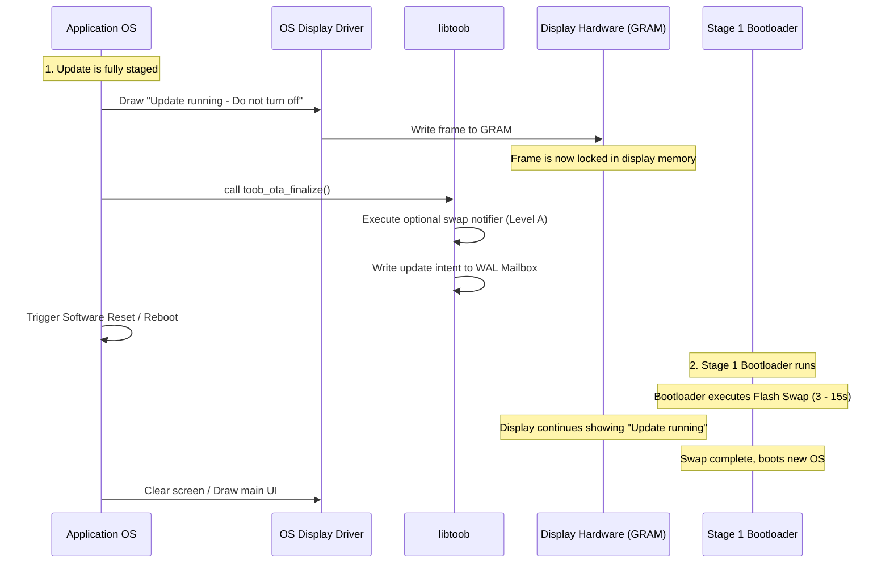

# Display-Persistence during Flash Swap (Stufe 0 / Level A)

This document describes the recommended, zero-overhead architecture for providing persistent visual feedback to users during active flash swaps.

## The Challenge

During an update swap, the device is running in **Stage 1 (Bootloader)**. Because the bootloader has a strict size limit of 64 KB, it is highly discouraged to compile graphics libraries or display drivers into the bootloader binary. 

Doing so increases the attack surface, breaks modularity, and violates root-of-trust footprint budgets.

---

## The Solution: Hardware-Hold (GRAM / E-Ink)

Most modern displays have a hardware-hold mechanism:
- **E-Ink / E-Paper**: These are bi-stable displays. They hold their state indefinitely without any power.
- **GRAM-Based LCDs / OLEDs**: Most SPI/I2C displays (e.g. ST7789, ILI9341, SSD1306) have their own integrated controller and dedicated Graphics RAM (GRAM). As long as the display panel remains powered (even if the main MCU is undergoing a hardware reset or running bootloader code), the screen will continue displaying the last frame written to its GRAM.

By utilizing this hardware property, the **main OS can draw the update status screen before rebooting**, achieving zero bootloader code size footprint.

---

## Step-by-Step Update Flow

The following sequence details how persistent display status is achieved without bootloader involvement:



---

## Implementation via libtoob Hook

To integrate with manufacturer-specific display drivers, `libtoob` provides a pre-update hook that is triggered inside `toob_ota_finalize()` right before writing the WAL transition:

```c
#include "libtoob.h"

// 1. Define your custom notifier callback
void my_swap_notifier(const toob_swap_event_t *ev) {
    if (ev->phase == TOOB_SWAP_PHASE_PREPARE) {
        // Render the splash screen to the display panel
        display_draw_splash_screen("Update in progress. Please wait...");
        display_flush();
    }
}

// 2. Register the hook during OS startup
void app_init(void) {
    toob_set_swap_notifier(my_swap_notifier);
}
```

This ensures that the screen is refreshed immediately before the device reboots, keeping the "Update in progress" screen active during the entire flash swap duration.
