# Toob-Boot Manifest Compiler — Pipeline-Spezifikation

> Dieses Dokument beschreibt die vollständige Verarbeitungspipeline des
> `toob-manifest compile` Befehls. Voraussetzung: Kenntnis der
> `device.toml` Spec und `chip_database.py`.

---

## 1. Gesamtübersicht (High-Level Flow)

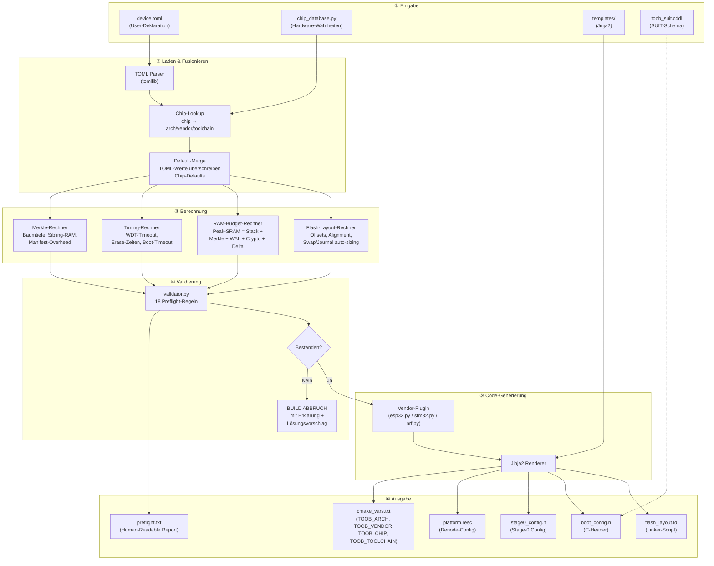

---

## 2. Phase ② Detail: Laden & Fusionieren

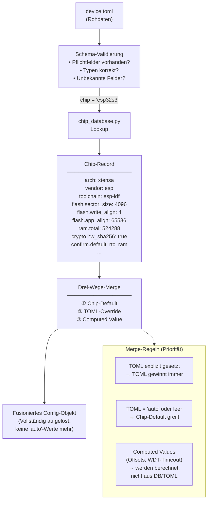

### Merge-Beispiel (ESP32-S3)

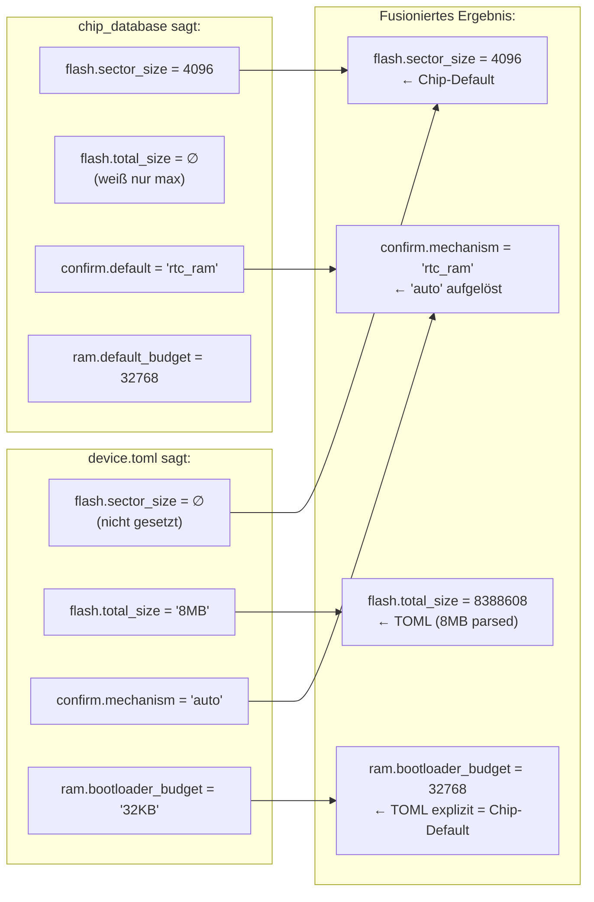

---

## 3. Phase ② Detail: Flash-Layout-Berechnung

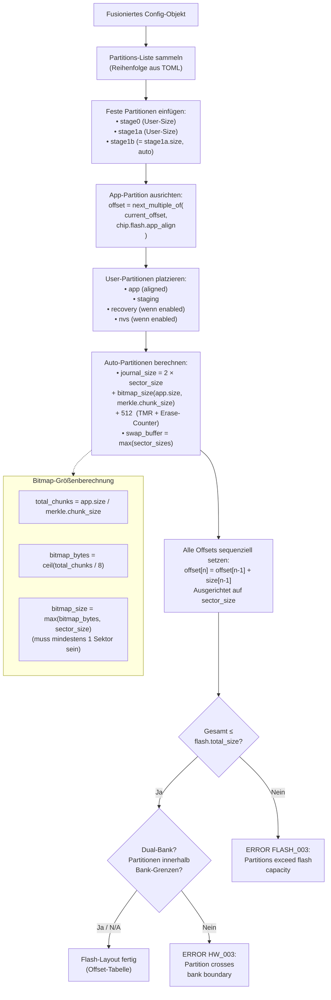

### Flash-Layout-Ergebnis (Datenstruktur)

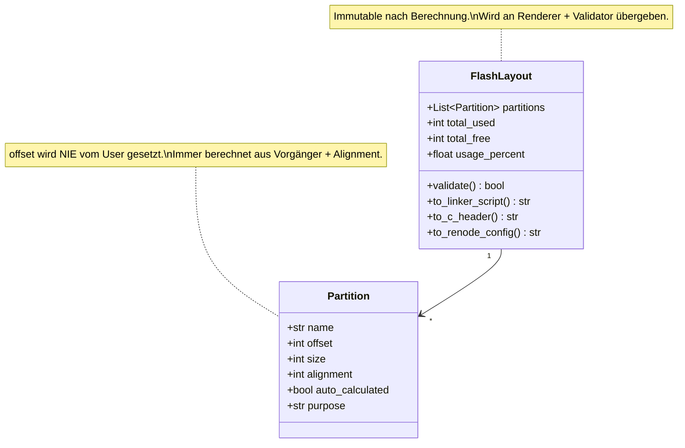

---

## 4. Phase ③ Detail: RAM-Budget-Berechnung

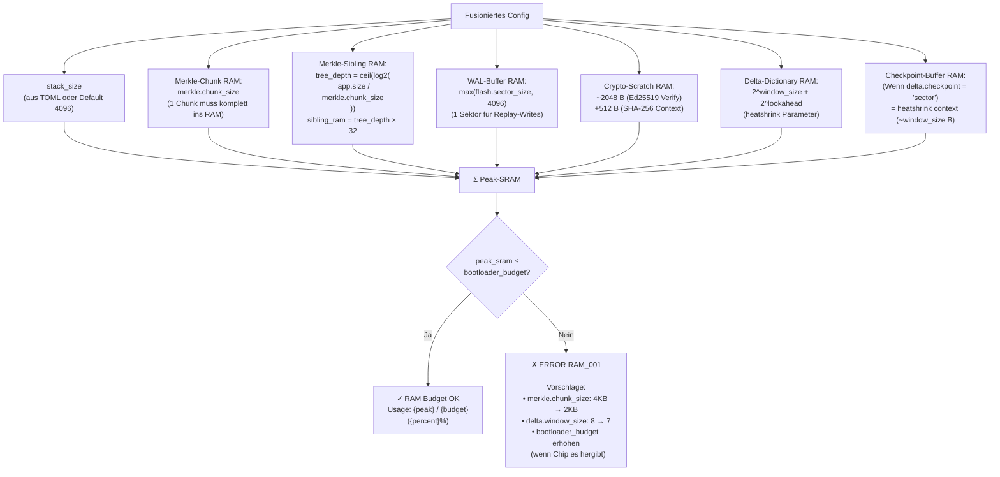

---

## 5. Phase ④ Detail: Validierung (validator.py)

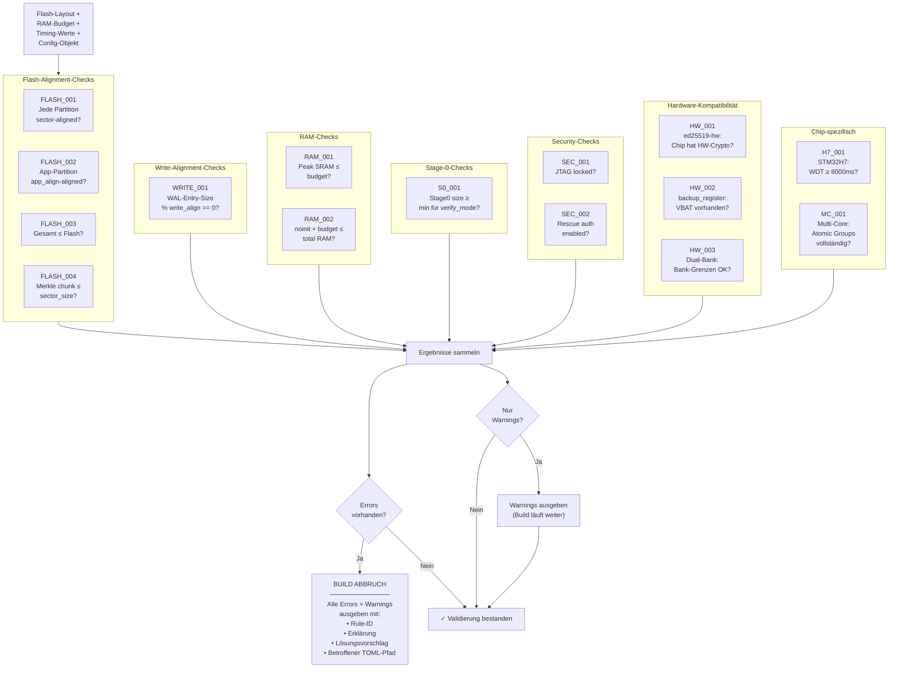

---

## 6. Phase ⑤ Detail: Vendor-Plugin & Code-Generierung

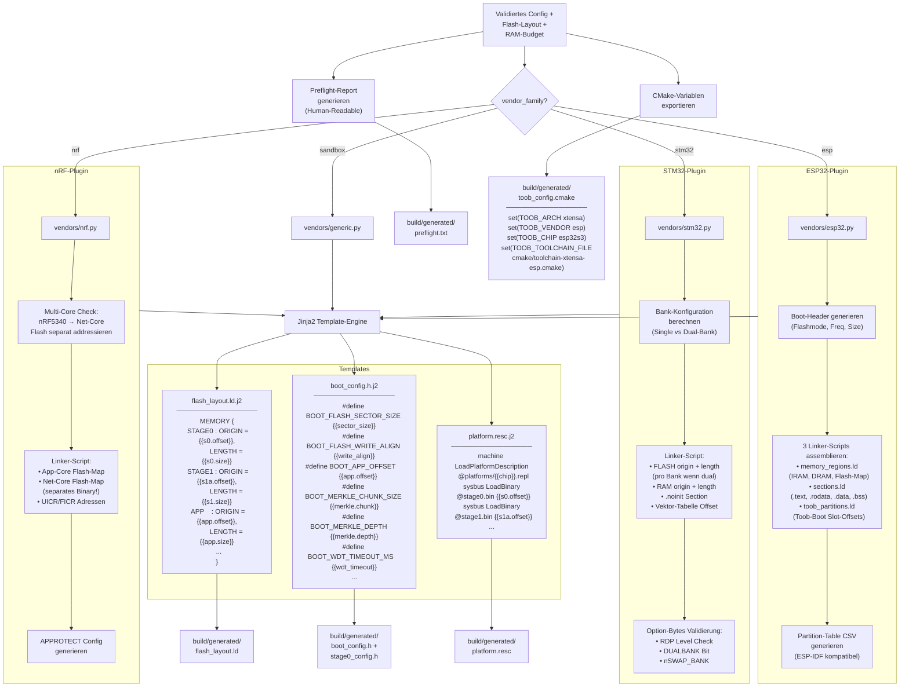

---

## 7. Gesamter CLI-Aufruf (Sequenzdiagramm)

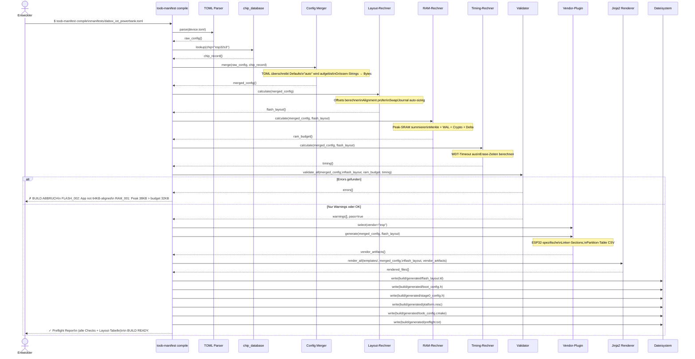

---

## 8. Vendor-Plugin Interface (Klassendiagramm)

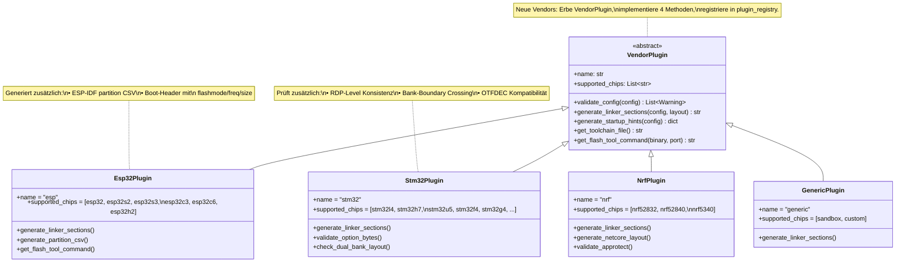

---

## 9. Datenfluss: Was kommt rein, was geht raus

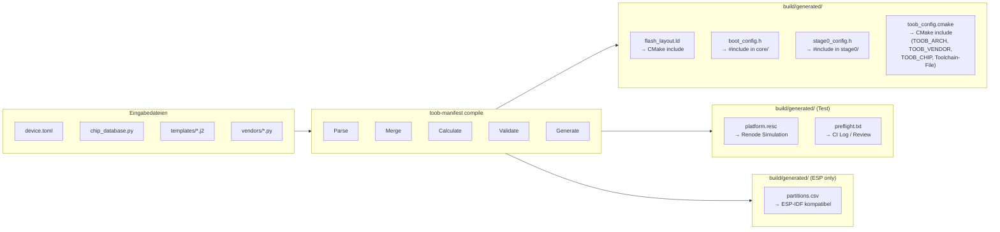

---

## 10. Fehlerbehandlung: Entscheidungsbaum

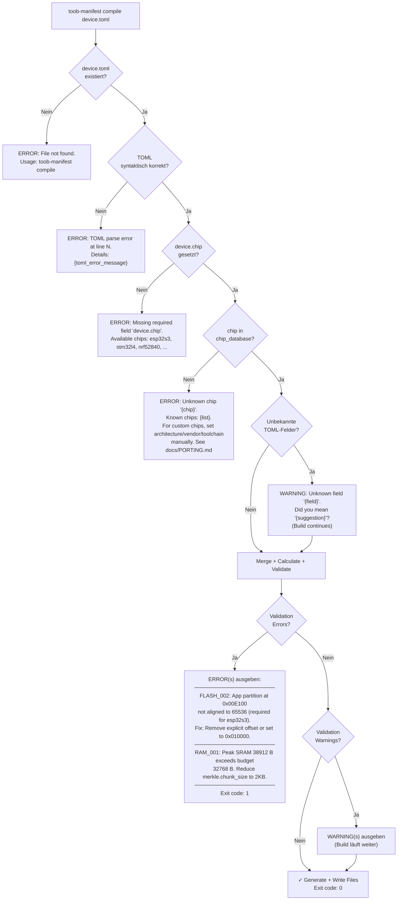

---

## Anhang: CLI-Interface

```
USAGE:
  toob-manifest compile <manifest.toml> [OPTIONS]

OPTIONS:
  --output-dir <DIR>     Output-Verzeichnis (Default: build/generated/)
  --dry-run              Nur validieren, nichts schreiben
  --verbose              Alle Merge-Entscheide anzeigen (Debug)
  --format <FMT>         Preflight-Output: text | json | github-actions
  --chip-override <CHIP> Chip überschreiben (für CI-Matrix-Builds)

EXAMPLES:
  # Standard-Build
  toob-manifest compile manifests/dabox_iot_powerbank.toml

  # Nur validieren (CI-Check)
  toob-manifest compile manifests/generic_stm32h7.toml --dry-run

  # CI-Matrix: gleiche TOML, verschiedene Chips
  toob-manifest compile manifests/generic.toml --chip-override esp32c3
  toob-manifest compile manifests/generic.toml --chip-override nrf52840

  # GitHub Actions Annotations
  toob-manifest compile device.toml --format github-actions
  # Gibt ::error:: und ::warning:: Annotations aus

EXIT CODES:
  0  Erfolg (ggf. mit Warnings)
  1  Validierungsfehler (Errors)
  2  Datei nicht gefunden / Parse-Fehler
```
