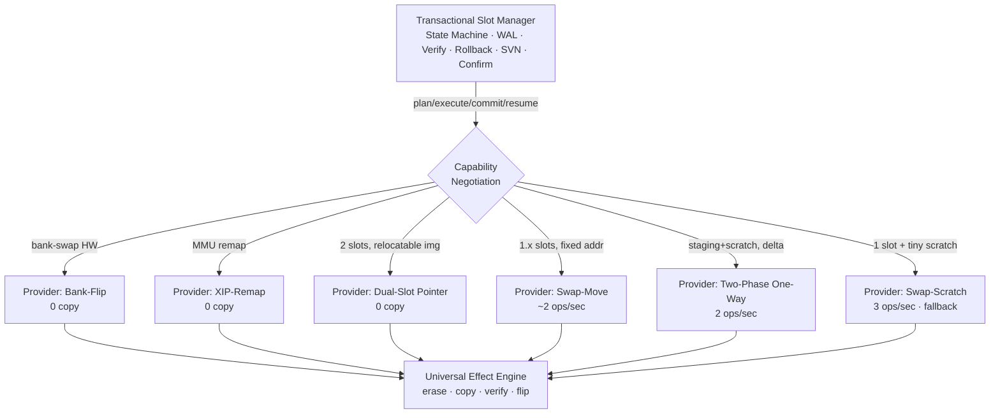

# Masterplan: Chip-übergreifende Slot-Update-Architektur

**Ziel:** Ein neues, verifiziertes Firmware-Image sicher (brownout-resumbar, rollback-fähig,
anti-rollback) in den Ausführungs-Slot bringen — mit **minimalem Flash-Verschleiß**, über eine
**heterogene Chip-Landschaft** (Cortex-M0..M33, RISC-V, ESP32-Familie, intern/extern Flash,
Single/Dual-Bank), ohne pro Chip die Sicherheitslogik neu zu erfinden.

---

## 0. Die Wurzel des Problems

Aller Swap-Verschleiß entsteht aus **einer** Ursache: die Ausführungsadresse ist fix, also muss das
Image physisch dorthin bewegt werden. Jede Null-Wear-Technik (HW-Bank-Swap, MMU-Remap, Direct-XIP)
löst dasselbe Prinzip:

> **Die Ausführungsadresse folgt dem Image — nicht umgekehrt.**

Der 3-Phasen-Swap-Scratch (3 Erases/geändertem Sektor + Scratch-Hotspot, ~390 Voll-Updates bis der
Scratch stirbt) ist die Strafe für fixe Ausführung ohne Remap. **Nordstern:** Ausführungsadresse dem
Image folgen lassen, wo der Chip es kann — und es möglichst vielen Chips **beibringen** (Build-Seite)
—, und nur beim echt constrainten Single-Slot-Chip auf Kopieren zurückfallen.

---

## 1. Das Trennungsprinzip: Invariante vs. Strategie

Der zentrale Architektur-Schnitt. Zwei Schichten:

**A. Transactional Slot Manager (TSM) — chip-agnostisch, EINE Implementierung.**
Besitzt die *Invarianten*, die auf jedem Chip identisch gelten:
- **Atomarität:** Ein Update committet ganz oder rollt ganz zurück. Nie bootet ein Halbzustand.
- **Verifikation:** Das Ziel-Image wird kryptografisch geprüft, *bevor* es booten darf — unabhängig
  davon, wie es dorthin kam.
- **Rollback-Garantie:** Bis zum Confirm existiert immer ein wiederherstellbares Vorgänger-Image.
  *Wo* es liegt, ist Strategie; *dass* es existiert, ist Invariante.
- **Brownout-Resume:** Die Operation ist gecheckpointet und idempotent fortsetzbar.
- **Anti-Rollback (SVN):** strategieunabhängig.
- **Tentative/Confirm:** strategieunabhängig.

**B. Slot Transport Provider (STP) — pro Chip-Klasse, austauschbar.**
Realisiert nur das physische Bewegen unter einem schmalen Interface. Wird per
Capability-Negotiation ausgewählt.

**Der Code ist auf halbem Weg dorthin.** `flash_effect_t` + `boot_effect_execute` sind bereits eine
universelle „Effekt-ISA" (erase/copy/verify mit post-CRC + Whitelist), und `boot_swap_plan_chunk`,
`boot_multiimage_plan_component`, `boot_rollback_plan_chunk` sind bereits *Strategie-Planer*, die
einen gemeinsamen Executor füttern. Der Masterplan **formalisiert** das: Executor = universell,
Planer = Provider, plus ein Provider-Registry und Capability-Auswahl.

---

## 2. Der universelle Commit: Boot-Pointer statt Swap

Die sichersten Updates haben **einen atomaren Commit-Punkt** (den HW-Bank-Flip). Für Chips ohne
HW-Atomarität **emulieren** wir ihn — mit exakt der A/B-Technik aus der Mailbox:

- Eine kleine, redundante, wear-gelevelte **Boot-Pointer-Region**: Record
  `{ active_slot, version, seq, crc }`, zwei Sektoren A/B, höchste gültige `seq` gewinnt.
- Boot: Pointer lesen → aktiver Slot bekannt.
- **Commit = einen neuen Pointer-Record schreiben, der `active_slot` umlegt.** Brownout mitten im
  Flip → der alte Record überlebt (A/B) → atomar.
- **Rollback = Pointer zurückflippen.** Null Image-Bewegung.

Damit kollabieren *alle* Strategien auf ein Modell: **„Secondary vorbereiten, Pointer flippen."** Der
Unterschied zwischen den Providern ist nur noch, ob „das aktive Image an der Ausführungsadresse
materialisieren" gratis ist (Remap/Bank) oder eine Kopie braucht (fixe Adresse). Die Mailbox-A/B, die
schon steht, ist die Blaupause für diese Region.

---

## 3. Capability → Strategie (die Antwort auf „alle Chips")

Der Chip-HAL deklariert einen `slot_caps_t`: `has_bank_swap`, `has_xip_remap`, `slot_count`,
`has_scratch`, `exec_model ∈ {fixed, xip_remap, pic, ram}`, Sektor-Geometrie, `endurance`. Der TSM
wählt den **höchsten** verfügbaren Tier und fällt herunter.

| Tier | Voraussetzung | Provider | Wear (neues Image) | Rollback | Chips (Beispiele) |
|------|---------------|----------|--------------------|----------|-------------------|
| 0 | HW-Dual-Bank | Bank-Flip | 1 E + 1 W / Sektor | Flip (0) | STM32 BFB2, viele NXP/Renesas |
| 0 | XIP-MMU-Remap | XIP-Remap | 1 E + 1 W / Sektor | Remap (0) | ESP32-S3/C6, manche RISC-V |
| 1 | 2 Slots + relocatable Image | Dual-Slot-Pointer | 1 E + 1 W / Sektor | Pointer (0) | jeder Cortex-M mit VTOR + 2 Slots |
| 2 | 1.x Slot, fixe Adresse | Swap-Move | ~2 ops / Sektor, kein Hotspot | via Move | constrained Cortex-M0/M3 |
| 3 | Staging + Scratch (Delta) | Two-Phase One-Way | 2 ops / Sektor | Staging | aktueller Delta-Pfad (Fix!) |
| 4 | 1 Slot + winziger Scratch | Swap-Scratch | 3 ops / Sektor + Hotspot | Staging | letzter Fallback |

**Die entscheidende Einsicht:** Tier 0–1 sind alle **Null-Kopie** und unterscheiden sich nur im
Flip-Mechanismus. Das Ziel ist, **so viele Chips wie möglich in Tier 0–1 zu heben** — und das ist zur
Hälfte eine Build-Frage (Abschnitt 4), nicht nur eine Bootloader-Frage.

---

## 4. Build-Co-Design: relocatable Images (der Multiplikator)

Ein fixe-Adresse-Chip mit 2 Slots kann Tier-1-Pointer-Swap machen — **wenn das Image aus beiden Slots
laufen kann.** Das ist eine Toolchain-/Linker-Entscheidung, kein Bootloader-Trick:

- **Option A — Dual-Linked:** Das Image für Slot-A *und* Slot-B-Adresse linken, beide Fixup-Sätze
  ausliefern (Kosten: etwas Flash, trivial). Bootloader wählt den Vektor-Satz des aktiven Slots
  (VTOR auf Cortex-M).
- **Option B — Boot-Time-Relocation:** Eine kompakte Relocation-Tabelle mitliefern; der Bootloader
  patcht absolute Referenzen beim Handoff. Ein Erase/Write mehr beim ersten Boot, danach frei.
- **Option C — PIC/PIE:** vollständig positionsunabhängig. Toolchain-Zwänge + Laufzeit-Kosten, aber
  null Fixup.

**Empfehlung:** Dual-Linked als Default (billigster, robustester Weg), PIC als Opt-in für Chips/OSe,
die es sauber tragen. Damit wird Tier-1 auf praktisch jedem Cortex-M mit 2 Slots verfügbar — der
Swap-Scratch (Tier 4) schrumpft auf die echten Single-Slot-Winzlinge zusammen.

---

## 5. Unkonventionelle & mathematische Hebel

**5.1 Reverse-Delta-Rollback (der stärkste neue Gedanke).**
Bei Delta-Updates gilt: `alt + Δ = neu` und `neu + Δ⁻¹ = alt`. Statt die *ganze* alte App für
Rollback zu erhalten (teuer, und genau der Grund für den Austausch), erzeuge beim Build den
**Reverse-Patch Δ⁻¹** (winzig) und speichere nur ihn. Rollback = Δ⁻¹ auf die neue App anwenden.
`storage(rollback) = size(Δ⁻¹) ≪ size(alte App)`, und der Rollback-Verschleiß sinkt von „ganze App
kopieren" auf „kleinen Patch anwenden". Das eliminiert den Grund, die alte App überhaupt wholesale zu
bewegen.

**5.2 Der Swap als Permutation (minimal-move-Planer).**
Ein Update ist eine Permutation π auf Sektor-Inhalten. **Unveränderte Sektoren sind Fixpunkte (0
Moves — das ist der Identity-Skip).** Nur die geänderten Sektoren bilden nicht-triviale Zyklen; deren
Kosten bestimmt die Zyklenstruktur, nicht die Slot-Größe. Ein Planer, der π in Zyklen zerlegt und
jeden Zyklus mit den verfügbaren Spare-Sektoren minimal realisiert, ist **beweisbar optimal pro
Topologie** — und subsumiert Swap, One-Way und Swap-Move als Spezialfälle einer Zyklen-Engine.
Kombiniert mit 5.1 muss die alte App gar nicht materialisiert werden.

**5.3 Wear-aware adaptive Strategie.**
Ihr trackt bereits per-Region-Erase-Counter im TMR (`app/staging/swap_buffer_erase_counter`). Nutzt
sie **steuernd**, nicht nur berichtend: Der TSM wählt die Strategie, die den projizierten Verschleiß
*gegeben dem aktuellen Wear-Zustand* minimiert. Nähert sich der Scratch dem EOL, weicht er auf einen
Provider aus, der ihn meidet. Ein Bootloader mit Kostenmodell — für Firmware ungewöhnlich, hier
naheliegend, weil die Telemetrie schon existiert.

**5.4 Wear-gelevelter Scratch-Pool (billiges Zwischending für Tier 4).**
Wo Swap-Scratch unvermeidbar ist: den Scratch **nicht fix** halten, sondern über einen Pool von
Spare-Sektoren rotieren (Round-Robin via TMR-Zähler). Verteilt den Hotspot ohne die volle
Swap-Move-Komplexität. Der 80/20-Fix für die schwächsten Chips.

**5.5 Content-addressed Dedup (für flash-reiche Chips).**
Sektoren als content-addressed Store, Update = Versions-Map umbiegen (Copy-on-Write-Dateisystem für
Firmware). Rollback gratis (alte Map behalten). Overkill für MCUs, aber mächtig, wo Flash reichlich
ist — tauscht Flash gegen Wear + Simplizität.

---

## 6. Sofortmaßnahme: der Delta-Bug (bestätigt)

Unabhängig vom Langfristplan, **jetzt** zu fixen, weil er stille Korruption + Brick beim Rollback
verursacht: Für Delta ist `swap_src == CHIP_SCRATCH == boot_swaps Zwischenlager`; Phase A löscht den
Delta-Output, und Rollback kopiert den nutzlosen Delta-Stream aus Staging.

**Fix = Two-Phase One-Way Copy** (disjunkte Regionen, umgeht `boot_swap_apply` für Delta):
1. **Backup:** App(alt) → Staging. (Staging hält danach die alte App — genau wo `boot_rollback` sie
   erwartet.)
2. **Deploy:** Scratch(neu) → App.

Kein Adresskonflikt, nativer Rollback-Support, **2 statt 3 ops/Sektor**. Das ist zugleich der erste
konkrete Provider (Tier 3) der neuen Architektur.

---

## 7. Roadmap (abhängigkeitsgeordnet)

**Phase 0 — Blutung stoppen (jetzt).**
Delta-Bug via Two-Phase One-Way fixen. Die vier Swap-Sofortgewinne (Deduktion nur bei Resume,
Early-Exit-Erase, CRC-Reuse, Whitelist-Größe). Risiko 🟡, Aufwand M.

**Phase 1 — Zwei-Schichten formalisieren.**
TSM (Invarianten) vom STP (Strategie) trennen. `flash_effect_t`/`boot_effect_execute` als universelle
Engine deklarieren; die drei `*_plan_*`-Funktionen als erste Provider hinter ein `slot_transport_t`-
Interface ziehen. Risiko 🔴, Aufwand L.

**Phase 2 — Capability-Negotiation + Provider-Registry.**
`slot_caps_t` im HAL; TSM wählt Tier. Provider: Two-Phase-One-Way (aus Phase 0), Swap-Move,
Swap-Scratch-Fallback. Risiko 🔴, Aufwand L.

**Phase 3 — Universeller Boot-Pointer.**
Wear-gelevelte A/B-Pointer-Region (Mailbox-Tech wiederverwenden). Commit = Flip. Schaltet Tier-0/1
frei (Bank-Flip-, XIP-Remap-Provider). Risiko 🔴, Aufwand L.

**Phase 4 — Relocatable-Image-Co-Design (Build).**
Dual-Linked-Images in der Toolchain; VTOR-Auswahl im Handoff. Hebt fixe-Adresse-2-Slot-Chips nach
Tier 1. Risiko 🔴, Aufwand L (Toolchain + Bootloader).

**Phase 5 — Advanced Wear.**
Reverse-Delta-Rollback (5.1), wear-aware Auswahl (5.3), Scratch-Pool (5.4). Risiko 🟡–🔴, inkrementell.

**Phase 6 — Formale Verifikation der Invarianten.**
Den transaktionalen Layer modell-checken (Atomarität, kein Halb-Boot, Rollback-immer-verfügbar)
strategie-unabhängig — die Simulations-Methodik dieser Reviews hochskaliert. Risiko 🟢, laufend.

---

## 8. Die eine Garantie, die über allem steht

Egal welcher Provider, welcher Chip, welcher Brownout-Zeitpunkt: **Es bootet immer entweder das alte
verifizierte oder das neue verifizierte Image — nie ein Halbzustand, und bis zum Confirm ist ein
Rückweg garantiert.** Der TSM erzwingt das; die Provider dürfen nur die *Kosten* variieren, nie die
*Sicherheit*. Das ist die Grenze zwischen „schnell/sparsam" und „korrekt" — und sie ist nicht
verhandelbar.